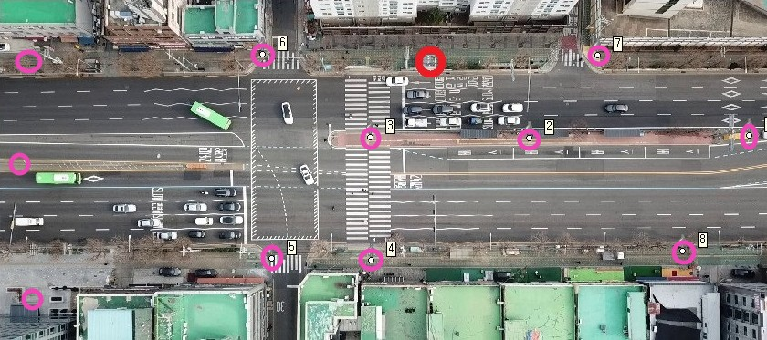

# UAV-traffic-analysis

This project aims to count every vehicle (bus, car, truck) detected in the input video using **YOLOv5** object-detection algorithm. It also calculates speed, acceleration of every vehicle 

## DEMO  


## Steps to run   

1. Clone this repository  

    ```
    git clone https://github.com/Garvit-32/UAV.git
    ```    

 2. Install all the dependencies  

    ```  
    pip install -r requirements.txt   
    ```  

3. Collect 6-8 coordinates points (latitude, longitude) from google maps and (x, y) from the image and put it in Code/localization/localization_from_points.py from there you get the pixel delta (delta x, delta y) which is used to calculate distance, speed and acceleration of vehicle later.


    

    In the given script, 8 points of this image are given, likewise you have to collect and put. 


4. Exceute main script to start tracking 

    ```  
    python Code/main.py -p <path to video> -o <latitude and longitude coordinate of the center of the frame > -pd < pixel delta calculated from localization script>  
    ```
    Example  
    ```  
    python Code/main.py -p Input/DJI_0004_gt.mp4 -o "37.47646052, 126.89894" -pd "-2.00e-06, -2.00e-06"
    ```  

5. Evaluate Tracking (GroudTruth are required)

    ```  
    python Code/tracking_eval/tracking_eval.py -p <Path to folder containing groundtruth> -v <video name> 
    ```
    Example  
    ```  
    python Code/tracking_eval/tracking_eval.py -p Input/yolo_id -v DJI_0004_gt
    ```    

## References
1. https://github.com/ultralytics/yolov5
2. https://github.com/Videmo/pymot